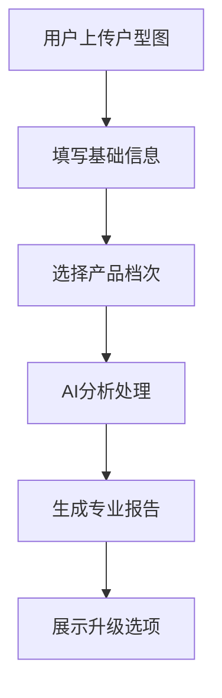

# AI风水分析网站 - 产品需求文档 (PRD)

## 1. 项目概述

### 1.1 产品愿景
打造全球最大的AI驱动风水分析平台，让传统风水智慧通过现代科技为全球华人服务。

### 1.2 商业目标
- **短期目标**：3个月内验证市场需求，获得1000+用户
- **中期目标**：6个月内实现月收入1000美金
- **长期目标**：12个月内达成月收入3000-5000美金

### 1.3 目标用户
1. **海外华人**（主要）：美国、加拿大、澳洲等地华人社区
2. **留学生群体**：首次独立居住，对风水有兴趣
3. **年轻职场人士**：关注居住环境对运势的影响
4. **风水爱好者**：对东方文化感兴趣的非华裔用户

## 2. 产品架构

### 2.1 三档产品体系

#### 免费体验版 - $0
**目标**：建立信任，展示价值
**功能**：
- 识别3个关键风水问题（穿堂煞、床对门、镜对床）
- 基础吉凶判断（安全/风险）
- 1-2条应急处理建议
- 报告展示升级提示

#### 标准分析版 - $19.99  
**目标**：满足80%用户核心需求
**功能**：
- 全面户型分析（识别所有问题类型）
- 分区评分系统（客厅、卧室、厨房等1-10分评分）
- 详细改善方案（即时改进 + 长期优化）
- PDF报告下载
- 邮件报告推送

#### 个性定制版 - $49.99
**目标**：服务高端用户，提升客单价
**功能**：
- 生辰八字与户型匹配分析
- 个性化摆设建议
- 分阶段优化计划（30天/60天/90天）
- 在线咨询支持
- 年度复查服务

### 2.2 核心功能流程

## 3. 技术需求

### 3.1 AI分析能力
- **问题识别**：自动识别15+类风水问题
- **评分系统**：8级专业评价体系（极吉到凶险）
- **方案生成**：基于风水知识库的改善建议
- **多语言支持**：中英文双语报告

### 3.2 用户体验要求
- **响应速度**：分析完成时间<2分钟
- **界面简洁**：3步完成分析流程
- **移动优化**：支持手机拍照上传
- **报告质量**：专业排版，可导出PDF

### 3.3 数据收集需求
- **用户行为**：访问路径、停留时间、点击热点
- **转化漏斗**：各环节转化率统计
- **反馈收集**：用户满意度和改进建议
- **效果追踪**：用户使用后的实际反馈

## 4. 商业模式

### 4.1 验证期策略（1-3个月）
- **免费模式**：所有用户享受免费体验版
- **意愿测试**：显示付费选项但收集邮箱
- **数据收集**：验证真实需求和付费意愿

### 4.2 商业化策略（3个月后）
- **付费转化**：基于验证数据启动收费
- **用户分层**：不同档次服务不同需求
- **复购机制**：季度复查、新房分析等

### 4.3 收入预测
基于保守估算（月访问1600次，转化率1%）：
- 免费用户：1584人
- 标准版：12人 × $19.99 = $239.88
- 定制版：4人 × $49.99 = $199.96
- **月收入预计**：$439.84

## 5. 运营策略

### 5.1 流量获取
1. **内容营销**（零成本，60%流量）
   - TikTok短视频：痛点类、对比类内容
   - 社交媒体：风水知识科普
   - SEO优化：长尾关键词排名

2. **社群营销**（低成本，30%流量）  
   - 海外华人租房群、留学群
   - 分享实用风水小技巧
   - 建立专业权威形象

3. **搜索引擎**（长期收益，10%流量）
   - 优化英文关键词
   - 本地SEO优化
   - 内容持续更新

### 5.2 转化优化
- **信任建立**：专业报告展示、用户评价
- **价值展示**：免费版突出付费版价值点
- **决策简化**：清晰的产品对比和选择引导

## 6. 验证指标

### 6.1 市场需求验证
- **流量指标**：月访问1000+用户
- **参与度**：平均使用时长>3分钟
- **内容质量**：用户反馈满意度>4.0/5.0

### 6.2 付费意愿验证  
- **转化意向**：升级按钮点击率>5%
- **邮箱收集**：有效邮箱收集>100个
- **复访行为**：30%用户会再次访问

### 6.3 产品可行性验证
- **技术稳定性**：AI分析成功率>95%
- **用户体验**：完整流程完成率>80%  
- **成本控制**：单用户服务成本<$1

## 7. 风险评估

### 7.1 市场风险
- **接受度低**：用户对AI风水分析存疑
- **竞争加剧**：类似产品快速复制
- **文化差异**：海外用户理解偏差

**应对策略**：内容教育、差异化服务、本土化适配

### 7.2 技术风险  
- **AI准确性**：分析结果不准确影响口碑
- **系统稳定性**：高并发时性能问题
- **数据安全**：用户隐私泄露风险

**应对策略**：专家验证、性能监控、安全防护

### 7.3 运营风险
- **获客成本高**：免费流量获取困难
- **转化率低**：免费到付费转化不理想
- **时间投入**：每日1小时限制影响进展

**应对策略**：精准定位、优化转化、高效工作

## 8. 实施计划

### 阶段一：基础验证（1个月）
- [ ] 优化免费版AI分析质量
- [ ] 建立用户反馈收集机制  
- [ ] 开始内容营销获取初始用户
- [ ] 验证目标：日活50+用户

### 阶段二：深度验证（2-3个月）
- [ ] 添加付费选项UI但不实现支付
- [ ] 扩大营销渠道和内容产出
- [ ] 收集用户付费意愿数据
- [ ] 验证目标：月访问1000+用户

### 阶段三：商业化准备（4个月）
- [ ] 解决海外收款问题
- [ ] 开发完整付费功能
- [ ] 准备正式商业化上线
- [ ] 目标：实现首批付费用户转化

## 9. 成功标准

### 验证成功标准
满足以下条件则继续投入商业化：
- 月访问用户数>1000人
- 升级按钮点击率>3%
- 用户满意度评分>4.0/5.0
- 获得50+用户正面反馈

### 验证失败标准
出现以下情况则考虑调整或终止：
- 连续2个月用户增长停滞
- 升级点击率<1%
- 负面反馈占比>30%
- 技术成本超出预算100%

---

*文档版本：v1.0*  
*更新日期：2025-08-23*  
*负责人：项目负责人*